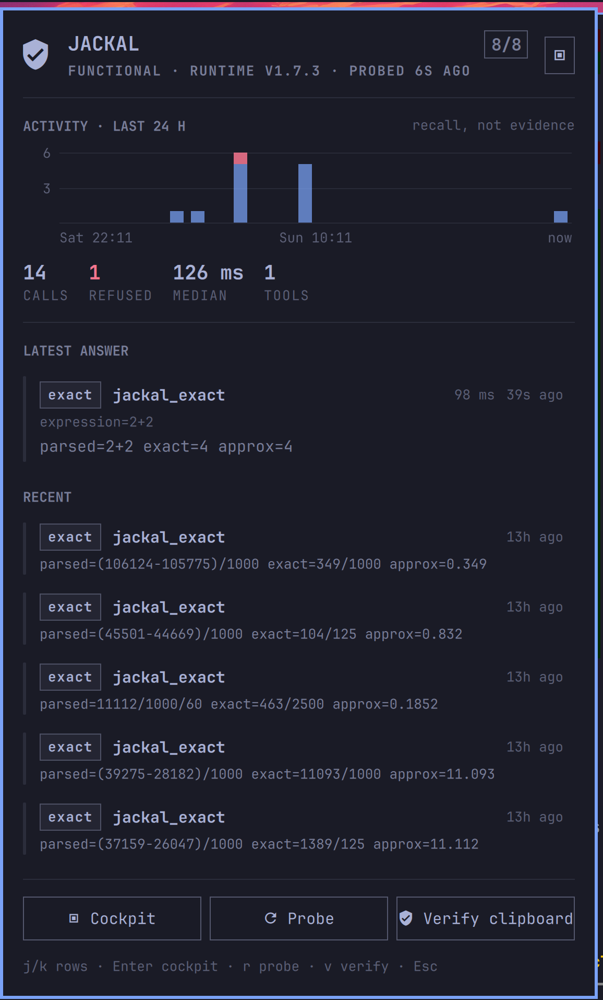

# JACKAL Omarchy Edition

An evidence surface for the JACKAL mathematical evidence kernel, built the way
Omarchy builds its own panels. Three surfaces share one service:

- **the bar pill** — session function as a single glyph, with the number of
  kernel calls in the last hour beside it (a count of ledger rows, which says
  the kernel was used and states no answer);
- **the dropdown** — an ordinary Omarchy keyboard panel: hero, a live activity
  instrument over the operator's window, the latest answer, the recent feed and
  one-key actions;
- **the cockpit** — full-screen mission control with seven decks: overview,
  ledger, graph, probes, verify, register and THOTH.

Every colour, size and spacing comes from the active Omarchy theme through the
shell's `Color` and `Style` singletons; the plugin carries no palette of its
own, so it looks native under Tokyo Night, Ashfall or anything else you apply.



JACKAL's defining rule is preserved at the display boundary: every result keeps
the status class returned by the kernel, every refusal keeps its named reason,
and a convenient visualization never becomes evidence because it looks
convincing.

THOTH is the name of JACKAL's integrated measurement and provenance subsystem.
It is not a separate service, personality, arithmetic engine, or source of
assurance.

The cockpit prints only numbers it read: the declared tool count and the
evidence register come from the installed runtime's own
`capability_inventory_v1.json`, the session function from tools executed in
this shell session, and every activity figure from the local ledger. Nothing on
any deck is typed in, and the surfaces keep **SEALED RUNTIME**, **INTEGRATED
THOTH** and **LOCAL RECALL** visibly separate.

The graph deck's rule is the panel's rule: sweeps are computed by the
installed runtime's own `jackal-native worksheet` lane in bounded batches, a
sample the evaluator refuses becomes a break in the curve rather than an
invented value, and the render stays `status=estimated` visualization —
pixels are not proof.

## What this repository contains

This repository is the Omarchy integration, not a copy of the JACKAL runtime.

| Component | Role | Assurance boundary |
|---|---|---|
| `Panel.qml` | Bar entry point and dropdown | Presentation only |
| `Service.qml` | Process and file adapter | Routes observations; performs no mathematics |
| `Model.js` | Pure classification and rendering model | Preserves declared classes; does not mint them |
| `bin/omarchy-jackal` | Operator diagnostics | Separates presence, integrity, and function |
| `verify_artifact.py` | Receipt/bundle front-door router | Copies operator authorization into a JACKAL verification request |
| `bin/jackal-mcp-ledger` | Optional transparent MCP recorder | Local recall only; retained artifacts require re-verification |
| `assets/` | Graph and workspace previews | Pixels are not proof |
| `formal/` | SPARK assurance-policy kernel and proof gate | Component-scoped Platinum claim only |
| `assurance/` | Bidirectional requirements and residuals | Machine-readable claim boundary |

The mathematical runtime, formal checkers, domain packs, and MCP tool schemas
remain in the public [JACKAL repository](https://github.com/AnubisQuantumCipher/jackal).
Keeping the repositories separate prevents desktop release work from silently
relabeling or rebuilding the evidence kernel.

## Runtime dependencies and requirements

- Omarchy Quattro with the current shell plugin interface.
- A supported JACKAL runtime installed through the JACKAL Codex plugin.
- `/usr/bin/python3` with Python 3.10 or newer.
- `/usr/bin/wl-copy` for copy actions.
- `/usr/bin/cat` for reading local runtime declarations and ledger rows.
- The `codex` CLI for automatic discovery of the installed JACKAL provisioner.
- Anubis and Z3 only for the JACKAL lanes that declare those dependencies.

The plugin runs unsandboxed inside the long-lived Omarchy shell, as all Omarchy
shell plugins do. Review the repository before installation. Normal panel
operation requests no elevated operating-system access, installs no system
service, and opens no network connection.

See [Dependencies](docs/DEPENDENCIES.md) for the complete runtime and development
inventory.

## Install

Install from the public repository:

```sh
omarchy plugin add https://github.com/AnubisQuantumCipher/jackal-omarchy.git --enable
```

Omarchy clones the repository, validates `manifest.json`, places the plugin under
`~/.config/omarchy/plugins/khephri.jackal`, rescans the shell, and enables the
bar widget. No custom installer is required.

If JACKAL itself is not installed, the widget remains visible and reports
`NOT INSTALLED` or a named operator refusal. It does not download a runtime or
substitute another calculator.

For migration from a manually copied development version, backup that directory,
remove it through Omarchy, and then install the Git-managed repository:

```sh
omarchy plugin remove khephri.jackal
omarchy plugin add https://github.com/AnubisQuantumCipher/jackal-omarchy.git --enable
```

Omarchy backs up a non-Git plugin directory during removal. Review the printed
backup path before deleting it. Keep any additional manual backup outside
`~/.config/omarchy/plugins`; a visible backup there retains the original
manifest ID and is therefore discovered as a conflicting plugin.

Full installation and migration guidance is in
[Installation](docs/INSTALLATION.md).

## Use

Open the cockpit with `SUPER + SHIFT + J`, from the JACKAL entry in the app
launcher, or with `omarchy-shell shell summon khephri.jackal '{}'`.

| Where | Input | Action |
|---|---|---|
| bar | left click | Toggle the dropdown |
| bar | middle click | Open the cockpit |
| bar | right click | Execute fresh function probes |
| dropdown | `j` / `k` · `Enter` | Walk the latest and recent rows · open the cockpit on the ledger |
| dropdown | `h` / `l` · `Enter` | Walk the action row · run it |
| dropdown | `r` · `v` · `c` · `g` | Probe · verify the clipboard artifact · cockpit · graph deck |
| dropdown | `Tab` | Switch to the neighbouring bar panel |
| cockpit | `1` – `7` · `Tab` | Choose a deck · cycle decks |
| cockpit | `j` / `k` · `Enter` | Walk the ledger · expand a row (fields, arguments, non-claims) |
| cockpit | `Shift+R` · `Shift+V` | Probe now · verify the clipboard artifact |
| cockpit | `Shift+C` · `Shift+N` | Copy the package digest · copy the governing non-claim |
| cockpit | `Esc` | Close |

`omarchy-shell khephri.jackal deck <overview|ledger|graph|probes|verify|register|thoth>`
lands the cockpit on a deck; `probe`, `verify` and `state` are also routed.

The newest result is labelled recall wherever it appears, because a ledger row
is not evidence. A retained formal receipt — listed on the verify deck — can be
sent back through the real verification front door; only the returned verdict
applies, and a refusal there is the correct answer when the operator's
expectations do not authorize that request.

## Configure

The panel settings are managed through Omarchy:

| Setting | Default | Meaning |
|---|---:|---|
| `refreshIntervalSec` | 900 | Interval between function probes |
| `staleAfterSec` | 2400 | Age after which a probe establishes nothing current |
| `probeOnOpen` | `true` | Re-probe when an opened panel is stale |
| `expectationsPath` | blank | Blank resolves to `~/.config/omarchy/jackal-expectations.json` |
| `activityWindowHours` | 24 | Window for the activity instrument, status spectrum and call counts |
| `feedLimit` | 8 | Recent rows shown in the dropdown and the overview feed |
| `barShowActivity` | `true` | Show the last-hour call count beside the bar glyph |

Optional operator paths live in `~/.config/jackal-omarchy/config.json`. Start
from [config/config.example.json](config/config.example.json); do not place
credentials in it.

The verification authorization is deliberately separate:

```json
{
  "schema": "khephri.jackal-expectations-v1",
  "receipt": {
    "expected_release_epoch": "v1.7.2",
    "expected_command": "range-bound-cert",
    "expected_expression": "sqrt(x)",
    "expected_input_lo": "2",
    "expected_input_hi": "3"
  }
}
```

That file identifies what the operator intended to verify. Expectations are
never copied from the artifact under review. A different artifact must refuse.
See [Assurance Model](docs/ASSURANCE_MODEL.md).

## Optional result ledger

The panel reads `~/.local/state/jackal/results.jsonl` when present. To populate
it, configure an MCP client to start the bundled `bin/jackal-mcp-ledger` instead
of starting JACKAL directly. The wrapper forwards every byte before performing
best-effort recording and starts no alternative mathematical engine.

The wrapper resolves the JACKAL launcher in this order:

1. `JACKAL_MCP_LAUNCHER` supplied by the operator;
2. `mcp_launcher` in `~/.config/jackal-omarchy/config.json`;
3. the local source path reported by `codex plugin list --json`.

If none resolves to a canonical regular file, it refuses with
`core-launcher-not-found`. It never downloads or guesses a weaker backend.

## Assurance vocabulary

The widget carries JACKAL's vocabulary verbatim:

- `exact` — exact integer or rational computation outside the Lean chain;
- `formal-bounded` — a checker accepted a certificate in an admitted fragment;
- `bounded` — a conditional numerical enclosure, not a formal theorem;
- `checked` — a defined check passed;
- `estimated` — a numerical estimate, not a bound;
- `model-based` — conditional on an explicitly declared model;
- `refused` — the requested lane did not admit the request.

`exact` and `formal-bounded` are different evidence kinds. A consequence ceiling
is a separate axis and never raises assurance. `informational`, `advisory`,
`decision-boundary`, and `safety-critical` describe the maximum permitted use,
not the truth of an answer.

The graph obtains exact rational x-coordinates through JACKAL but renders f64 y
samples as `status=estimated`. The image is a visualization. Pixels are not
proof. The HELLGATE card remains `status=bounded`, `formal=false`; the UI must
never relabel it `formal-bounded`.

## Operator commands

The dropdown invokes its bundled CLI directly:

```sh
./bin/omarchy-jackal paths
./bin/omarchy-jackal identity
./bin/omarchy-jackal inventory
./bin/omarchy-jackal doctor --json
./bin/omarchy-jackal verify
```

`doctor` executes one canonical request per supported evidence family during
that invocation. `verify` delegates the runtime tree check to the identity-pinned
JACKAL provisioner only after the installed Codex plugin's own identity verifier
accepts. A displayed surface count remains release metadata, not execution
evidence. Neither command establishes universal correctness, publisher
authenticity, operating-system correctness, or hardware correctness.

See [Operations](docs/OPERATIONS.md) for interpretation and recovery procedures.

## Update and remove

```sh
omarchy plugin update khephri.jackal
omarchy plugin remove khephri.jackal
```

Removal unloads the Omarchy plugin. It does not delete the JACKAL runtime,
operator expectations, MCP ledger, or retained receipts. Those belong to
separate trust and retention domains.

## Development and verification

Run the repository gate:

```sh
./scripts/check.sh
```

The gate performs bidirectional requirement traceability, manifest validation,
JavaScript model tests, Python router and ledger tests, presentation invariants,
operator CLI tests, repository policy checks, the SPARK proof and exhaustive
SPARK-to-JavaScript differential conformance when GNATprove is available, shell
syntax checks, and QML linting when the local Omarchy imports make it available.
Release and CI runs set `JACKAL_REQUIRE_FORMAL=1`, which refuses to skip proof.

Individual checks:

```sh
omarchy plugin validate .
node tests/model.test.mjs
python3 -B tests/ledger.test.py --fast
python3 -B tests/presentation.test.py
python3 -B tests/operator_cli.test.py
python3 -B tests/repository.test.py
./formal/prove.sh
node tests/formal_conformance.test.mjs
```

The pure `Jackal_Assurance_Policy` component has a requirements-complete SPARK
Platinum claim. The complete mixed-language plugin does not. See
[SPARK Platinum Assurance Boundary](docs/PLATINUM_ASSURANCE.md),
[Development](docs/DEVELOPMENT.md), [Architecture](docs/ARCHITECTURE.md), and
[Release Process](docs/RELEASE_PROCESS.md).

## Security

Do not paste access tokens, private keys, receipts containing secrets, or
operator authorization into issues, logs, chat, or configuration committed to
Git. Revoke any credential once exposed.

Please report vulnerabilities privately according to [SECURITY.md](SECURITY.md).
The [Threat Model](docs/THREAT_MODEL.md) documents the unsandboxed shell boundary,
clipboard routing, ledger trust, subprocess surface, runtime locator, and update
risks.

## Engineering and aerospace use

This project is designed to make evidence boundaries inspectable in demanding
engineering workflows. It is not flight-qualified software, a certified tool,
an approved NASA or SpaceX workflow component, or an endorsement by those
organizations. Adoption for consequential work requires independent
requirements, hazard analysis, configuration control, tool qualification,
verification, validation, cybersecurity review, and operational approval.

The concrete pilot path is documented in
[Engineering Pilot Guide](docs/ENGINEERING_PILOT.md).

## Documentation

- [Installation](docs/INSTALLATION.md)
- [Architecture](docs/ARCHITECTURE.md)
- [Assurance Model](docs/ASSURANCE_MODEL.md)
- [Operations](docs/OPERATIONS.md)
- [Dependencies](docs/DEPENDENCIES.md)
- [Threat Model](docs/THREAT_MODEL.md)
- [Engineering Pilot Guide](docs/ENGINEERING_PILOT.md)
- [SPARK Platinum Assurance Boundary](docs/PLATINUM_ASSURANCE.md)
- [Development](docs/DEVELOPMENT.md)
- [Release Process](docs/RELEASE_PROCESS.md)
- [Contributing](CONTRIBUTING.md)
- [Security](SECURITY.md)
- [Changelog](CHANGELOG.md)

## Open source and independence

JACKAL Omarchy Edition is released under the [MIT License](LICENSE). The source,
tests, documentation, release scripts, QML, Python adapters, and JavaScript
classification model are public and reviewable.

This community project is not affiliated with, sponsored by, or endorsed by
Omarchy, 37signals, NASA, SpaceX, Texas Instruments, or their respective
affiliates. Product and organization names belong to their owners.

A white instrument bar means a function probe ran here and returned at its
declared class. It is not a universal correctness claim.
